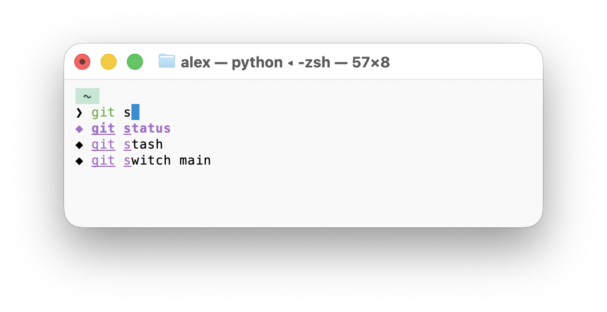

# zsh mouse and flex history search



Use the mouse to edit commands in your terminal just like regular text, drag and select, overwrite by typing. Automatically search zsh history with flexible priority fuzzy matching, and syntax highlighting. It works in other shells too when invoked directly.


## Install and Setup

Install from GitHub:

```bash
uv tool install git+https://github.com/uAIex/zsh-mouse-and-flex-search
printf '%s\n' 'eval "$(zsh-flex-history-init-zsh --hook)"' >> "${ZDOTDIR:-$HOME}/.zshrc"
```

Or install from a local checkout:

```bash
git clone https://github.com/uAIex/zsh-mouse-and-flex-search
cd zsh-mouse-and-flex-search
uv tool install .
printf '%s\n' 'eval "$(zsh-flex-history-init-zsh --hook)"' >> "${ZDOTDIR:-$HOME}/.zshrc"
```

Optionally, to import your existing Zsh history into the custom SQLite history database, run:

`zsh-flex-history-import`

## Uninstall

Remove the installed tool:

```bash
uv tool uninstall zsh-flex-history
```

Then remove this line from `${ZDOTDIR:-$HOME}/.zshrc`:

```zsh
eval "$(zsh-flex-history-init-zsh --hook)"
```

The local/Git installation builds a small Rust extension for fast flex matching,
so it requires a current [Rust toolchain](https://www.rust-lang.org/tools/install).

## Behavior

- Uses in-order flexible fuzzy matching (similar to Emacs `flex`).
- Failed commands show with a ○ character
- Shows a completing-read style vertical completion menu with highlighted match chars.
- Prioritizes first-token matches (command completion and matching command prefixes) ahead of deeper in-string matches, then scores by recency and query fit.
- For directory-aware prioritization, use `--use-custom-history` so history scoring can include current `cwd`, which improves relevance for repeated workflows per folder.
- Takes over mouse `x` from the native terminal app only when there is any text in the prompt.
- Syntax highlighting is "good enough" but incomplete

## Options


- `--use-custom-history`
  - Uses an alternate per-user SQLite history backend.
  - Stores commands as UTF-8 text by default, unlike zsh
  - Includes extra metadata per entry (`command`, `cwd`, `timestamp`).
- `--history-length <N>`
  - Maximum number of SQLite history rows to load on the daemon's initial startup from the custom history DB.
  - Accepts values like `10000` or `10k`.
  - If omitted, all custom history rows are loaded.
  - Applies only to `--use-custom-history` and only on the daemon's first load; normal `~/.zsh_history` is not trimmed.
  - Does not delete rows from the SQLite file. Later daemon refreshes load normally without this cap.
- `--print-only`
  - Prints the selected command to stdout instead of executing it.
- `--no-save-history`
  - Does not add the selected command to custom history.
- `ZSH_FLEX_HISTORY_EMPTY_SPACE_COMMAND`
  - When set to a non-empty command, pressing Space with an empty query accepts and runs that command immediately.
  - The command is never added to custom history.
- `ZSH_FLEX_HISTORY_COLOR`
  - Sets the ANSI color used for normal history results.
  - Accepts `0`-`15` or names like `red`, `green`, `yellow`, `blue`, `magenta`, `cyan`, `white`, `gray`, and `bright-blue`.
  - Defaults to the terminal's foreground color.
- `ZSH_FLEX_HISTORY_RUNTIME_COLOR`
  - Sets the ANSI color used for runtime completions.
  - Accepts the same `0`-`15` values and color names as `ZSH_FLEX_HISTORY_COLOR`.
  - Defaults to the terminal's foreground color.
- `ZSH_FLEX_HISTORY_CURSOR_COLOR`
  - Sets the ANSI background color of the visual cursor.
  - Accepts the same `0`-`15` values and color names as `ZSH_FLEX_HISTORY_COLOR`, plus `#RRGGBB` values such as `#ff0000`.
  - Defaults to the Doric cursor color.
- `ZSH_FLEX_HISTORY_NO_UNDERLINE`
  - Match underlines are disabled by default. This setting remains accepted for compatibility.
- Runtime path completion
  - Expands `$HOME` / `${HOME}`, `$PWD` / `${PWD}`, `$OLDPWD`, `$XDG_CONFIG_HOME`, `$XDG_DATA_HOME`, `$XDG_CACHE_HOME`, `$XDG_STATE_HOME`, and `$TMPDIR` for filesystem lookup.
  - Keeps the variable expression in the completed command, such as `$HOME/Documents/`.
## Keys

- `Up` / `Down` / Scroll: move selection
- `Tab`: inserts selected command
- `PageUp` / `PageDown`: move faster
- `Backspace`: delete query char
- `Enter`: print and optionally runs the selected command
- `Cmd-C` / `Cmd-V`: copy/paste query text in kitty while mouse takeover is active
- `Esc` or `Ctrl-C`: quit
